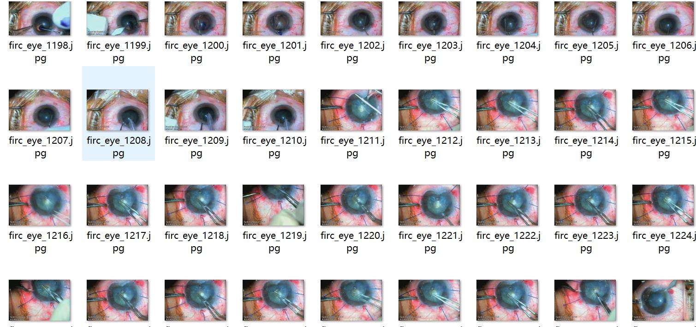
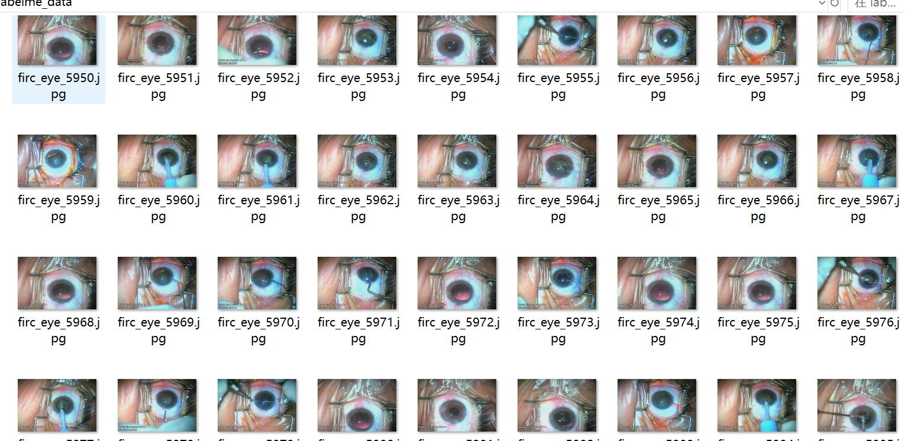

# LabelMe Format for Eyesight-Related Ophthalmic Cataract Surgery Devices and Segmentation of Eye Components in 6094 Images with 12 Categories

Dataset format: LabelMe format (does not include mask files, only includes jpg images and corresponding json files)
number of images: 6094  
annotation count: 6094  
annotationnumber of classes: 12  
annotation class names:["chaoshengruhuashoubing","fuzhuqiekoudao","fuzhuqixie","jiaomo","jingtizhiruqi","nangmoqiekaidaomao","niezi","niezimao","taoguan","tongkong","zhuqiekoudao","zhuxishoubing"]  
["Ultrasonic Emulsification Hand", "Auxiliary Incision Knife", "Auxiliary Instrument", "Cornea", "Lens Implanter", "Cap of Intraocular Lens Cutting Knife", "Needle", "Needle Cap", "Catheter", "Pupil", "Main Incision Knife", "Injection Pump Hand"]
boxes per class:   
chaoshengruhuashoubing count = 885  
fuzhuqiekoudao count = 111  
fuzhuqixie count = 672  
jiaomo count = 6093  
jingtizhiruqi count = 719  
nangmoqiekaidaomao count = 854  
niezi count = 1969  
niezimao count = 526  
taoguan count = 1237  
tongkong count = 6093  
zhuqiekoudao count = 751  
zhuxishoubing count = 923  
total boxes: 20833  
Using annotation tool: labelme = 5.5.0
Image resolution: Multi-resolution images, such as 720x480, 1920x1080, etc.
Annotation rules: Polygons are drawn around the classes.
Important notes: You can open and edit the dataset with labelme, and jsondataset needs to be converted into mask or yolo format or coco format for semantic segmentation or instance segmentation.
Special statement: This dataset does not guarantee any accuracy of the trained models or weight files.
Image preview:
Annotation examples:
Original images (select 16 images):
Annotation drawing results:
Labelme editing example image:
## Images

Here is a pay link on Stripe ( https://buy.stripe.com/3cs8yP7sY87d0vu9AB ). Please contact me lonlonago@foxmail.com after funding $89, and I will send you a complete data files , thank you!

